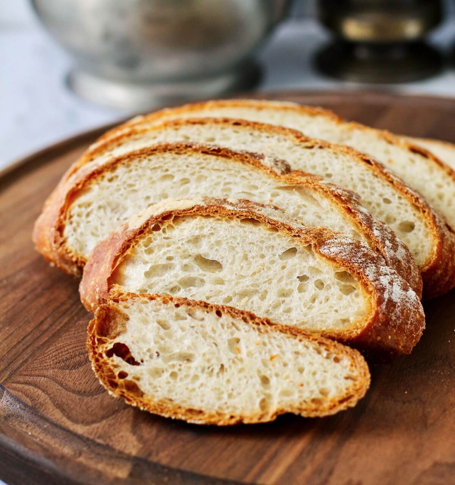

<a name="readme-top"/>

<br/>

<br />
<div align="center">
  <a href="https://github.com/SmithTCM/">
    
  </a>

  <h3 align="center">WD-Midterm-TX03</h3>
</div>
<div align="center">
  Midterm for Web Design
</div>

<br />


---

<br />
<br />

<!-- TODO: If you want to add more layers for your readme -->
<details>
  <summary>Table of Contents</summary>
  <ol>
    <li>
      <a href="#overview">Overview</a>
      <ol>
        <li>
          <a href="#key-components">Key Components</a>
        </li>
        <li>
          <a href="#technology">Technology</a>
        </li>
      </ol>
    </li>
    <li>
      <a href="#rules-and-principles">Rules and Principles</a>
    </li>
    <li>
      <a href="#resources">Resources</a>
    </li>
  </ol>
</details>

---

## Overview

Description of the project in details.

Guiding Question:
- What is the project?
- This is a project for Midterms in Web Design
- Whats the purpose?
- To create a website
- What are key components?
- Header and Design
- What technology used and how it is used?
- The tech used includes HTML5 and CSS3

### Key Components
<!-- TODO: List of Key Components -->

### Technology
<!-- TODO: List of Technology Used -->


## Rules and Principles
1. Always use ***WD-*** in the Title of the Project for the Subject
2. Do not rename any .html files; always use 'index.html' as the filename.
3. File Structure to follow

```
WD-ProjectName
└─ assets
|   └─ css
|   |   └─ style.css
|   └─ js
|   |   └─ script.js
|   └─ img
|       └─ fileWith.jpeg/.jpg/.webp/.png
└─ pages
|  └─ pageName
|     └─ index.html
|     └─ assets
|        └─ css
|        |  └─ style.css
|        └─ js
|        |  └─ script.js
|        └─ img
|           └─ fileWith.jpeg/.jpg/.webp/.png
└─ index.html
└─ readme.md
```

## Resources

| Title | Purpose | Link |
|-|-|-|
| W3Schools | Website was used to help with html code | https://www.w3schools.com/html/html_headings.asp |
| W3Schools | Website was used to help with css code | https://www.w3schools.com/css |
| Youtube | Followed code used in video as reference | https://www.youtube.com/watch?v=VegDvRLVlOI |
| Pinterest | used Image in pinterest | https://www.pinterest.com/pin/482940760032522667/|